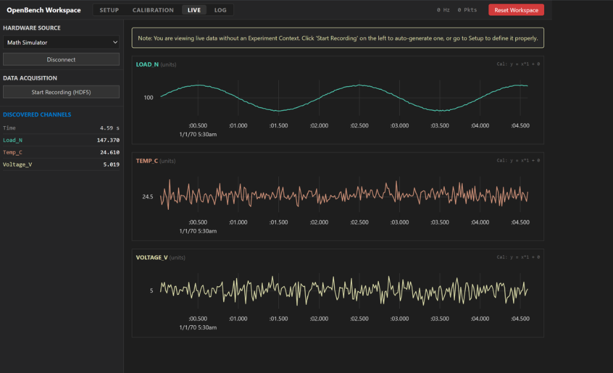

# OpenBench

**OpenBench is an open-source platform for reproducible physical experimentation.**

It is designed to replace proprietary, expensive, and closed-source DAQ (Data Acquisition) software with a production-ready telemetry platform. OpenBench connects physical hardware measurements to structured experiments, persistent datasets, analysis, and developer tooling. 

It is built on a simple philosophy: **Raw data is authoritative, hardware should not be tied to one vendor, and live visualization should never bottleneck acquisition.**



## The Core Concept

OpenBench moves beyond the standard "device → graph" dashboard paradigm. The architecture is driven by the **Experiment Context**.

`Experiment Context → Device → Sensors → Measurements → Analysis`

When you record data, OpenBench doesn't just save a loose CSV file. It ties the exact hardware configuration, test conditions, semantic sensor definitions, and calibration logic to the resulting dataset. Months after a test is completed, a researcher can open the data and know exactly what was tested, how it was calibrated, and what the raw sensor voltages were.

## Key Capabilities

- **Hardware Freedom:** Plug in an Arduino, ESP32, Teensy, Raspberry Pi, or any USB Serial DAQ. If it sends JSON over Serial, OpenBench discovers it.
- **Zero-Lag Visualization:** The UI uses imperative React updates and `uPlot` (WebGL/Canvas) to plot thousands of data points per second at 60Hz without freezing your browser.
- **Scientific Grade Logging:** Data is streamed via asynchronous, non-blocking queues directly to **HDF5** binary files (the same format used by CERN and NASA).
- **Dual-State Data Preservation:** OpenBench allows you to apply live calibration multipliers (Scale) and offsets to convert raw ADC values (e.g., Volts) into physical units (e.g., PSI, Newtons). **Both the raw and calibrated values are permanently logged.** 
- **One-Click Export:** Convert massive HDF5 binary logs into clean `.csv` files for Excel, MATLAB, Pandas, or Jupyter Notebooks.

---

## Getting Started

OpenBench is split into a Python/FastAPI acquisition backend and a React/Vite dashboard frontend.

### 1. Start the Backend (Acquisition & Storage)
The backend manages the serial connections, SQLite experiment database, and high-throughput HDF5 data logging.

```bash
cd backend
python -m venv venv
venv\Scripts\activate
pip install -r requirements.txt
python main.py
```
*(The backend runs on `http://localhost:8000`)*

### 2. Start the Frontend (Mission Control)
The frontend is the visual dashboard and workspace.

```bash
cd frontend
npm install
npm run dev
```
*(The UI runs on `http://localhost:5173`)*

---

## The Measurement Protocol

OpenBench is hardware agnostic. To connect custom hardware, simply program your microcontroller to print a JSON string over the Serial monitor at `115200` baud. 

OpenBench will automatically discover the keys, spawn real-time graphs, and provision datasets in the HDF5 binary.

**Arduino C++ Example:**
```cpp
void setup() {
  Serial.begin(115200);
}

void loop() {
  float temp = readThermocouple();
  float load = readLoadCell();
  
  // Format as {"sensors": {"Key": Value}}
  Serial.print("{\"sensors\": {");
  Serial.print("\"Temp_C\": "); Serial.print(temp);
  Serial.print(", \"Load_N\": "); Serial.print(load);
  Serial.println("}}");
  
  delay(20); // 50Hz update rate
}
```

Once your hardware is flashing data:
1. Open the OpenBench UI.
2. Select your COM Port from the **Hardware Source** dropdown and click **Connect**.
3. (Optional) Go to the **Setup** and **Calibration** tabs to define your experiment context and sensor calibration.
4. Click **Start Recording (HDF5)**.

---

## License
MIT License. Free for both academic and commercial engineering use. Build something incredible.
